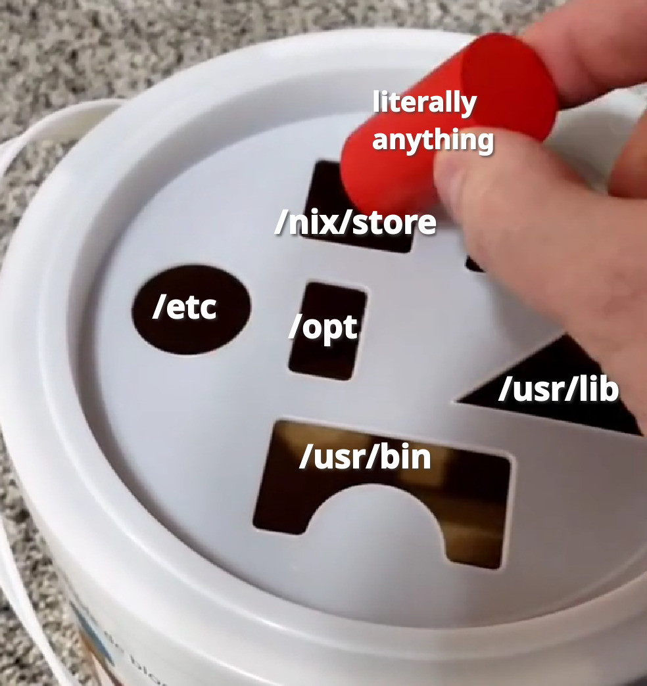
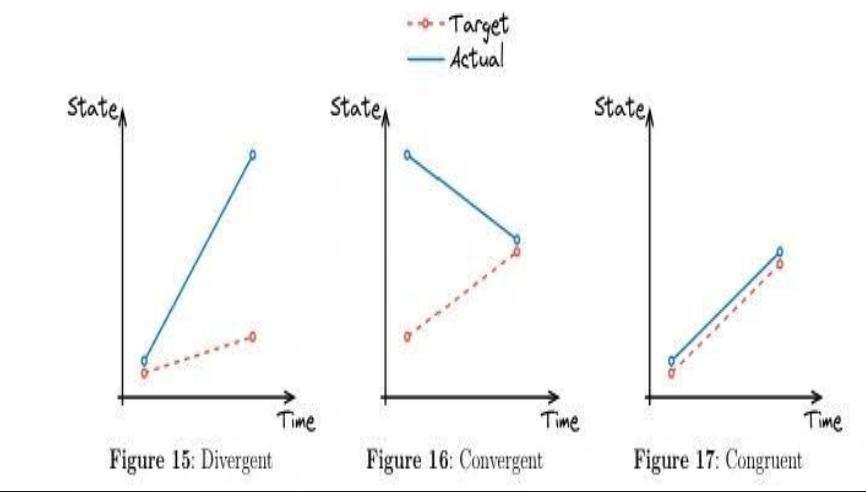

---
theme:
  name: catppuccin-mocha
options:
  end_slide_shorthand: true
  implicit_slide_ends: false
---

<!-- jump_to_middle -->

Thought for the day:

"Following existing established ways is one way to solve,
**And so is finding a way**. That's the birth of innovation"
===

<!-- font_size: 7 -->
<!-- end_slide -->
<!-- column_layout: [1, 1] -->
<!-- column: 0 -->


<!-- column: 1 -->

**What's Nix and it's ecosystem of approaches in a Bird's eye view**
===

<!-- reset_layout -->

<!-- new_lines: 3 -->

<!-- alignment: center -->

**By**

## Vivekanandan KS


---

<!-- font_size: 7 -->

# What to Expect

<!-- incremental_lists: true -->

- **Target Audience: Absolute beginners to veterans**
- **Core Goal: Nix, it's approaches and it's ecosystem's overview**
- **First Principle Thinking: Pure functional declarative vs declarative vs imperative automation**

<!-- font_size: 7 -->

# Expected Outcomes

**By the end of this talk, you'll gain a new mental model for approaching modern workflows.**

<!-- incremental_lists: true -->

- **Understand: What is Nix?**
- **Apply: How nix does things?**
- **Compare: Why a pure functional declarative approach is far more reliable and necessary compared to imperative setups**
- **Decide: Why containers (Docker, Podman) aren't always the necessary solution, and when/where to choose reproducibility and isolation instead**

---

<!-- font_size: 4 -->

<!-- column_layout: [1, 1] -->
<!-- column: 0 -->

## Pre-requisites

**Just some open mind and a broader look at problem solving**

**And some curiosity, interest etc :-)**

<!-- column: 1 -->

## Format

**First theory, then some examples and interactive Q&A**

**So feel free to ask any doubt if u think it's stupid**

<!-- reset_layout -->

---

<!-- font_size: 4 -->

# Let's Dive In!

---

What is Nix?
===

The revolutionary Universal build system for reliability, reproducibility and precise control to create artifacts like:

- Packages (nixpkgs) , Like bazel, mavern, gradle etc but universal
- OCI Images, containers (nix dockerTools, nixos-containers) alternative to DockerFile
- Nix (nix shell / nix develop) is the universal environment manager that isolates system-level packages, native libraries,
  and multi-language toolchains, replacing language-specific tools like Python's venv, Node's nvm, Ruby's rbenv, and Rust's rustup with a single reproducible workflow.
- System (NixOS)
- VMs and microVMS
- YAML, JSON, any config files, scripts etc etc
- Literally anything to be honest

all of these written in same language, universal caching, 100% reproducible, portable, and thus
**Anything as Code**

---

Nix workflow overview
===

Nix config –(Nix builder)--> Artifacts in /nix/store –(X)--> Artifact Symlinking according to X
The X here is any type of artifact as in
NixOS: Artifacts symlinked across the OS(root and home directories)
Nix shell: artifacts symlinked in PATH temporarily
etc etc
Nix builds: artifacts(binary) symlinked in project directory - packages, OCI, files etc



---

<!-- column_layout: [1, 1] -->
<!-- column: 0 -->

Features of Nix Build System:
===

- Purely functional
- Declarative
- Atomic
- Immutable
- Hermeticity
- Incremental Builds
- Provenance
- Sandboxing
- System Specificity
- Cross compilation
- Caching
- And many many more

<!-- column: 1 -->

Some of the plethora of benefits:
===

- 100% Bit to Bit Reproducible
- Universal caching
- Language and ecosystem agnostic
- Super reliability and determinism
- Air-Gapped deployments
- Supply chain security

<!-- reset_layout -->

---

How multiple versions coexist
===

Nix Store : The Immutable Read Only Store
How it’s different from traditional PMs - Hashing, Symlinks.
Hashing - Thus coexistence of any number of versions of same artifacts.

Eg:
/nix/store/`b6gvzjyb2pg0kjfwrjmg1vfhh54ad73z`-firefox-33.1

/nix/store/`xg789xfd6g7d87fg6xd7g6f7x86g7xdf`-firefox-41.2

---

Let's see how Nix works with a simple example
===

What's a function?
===

<!-- column_layout: [1, 1] -->
<!-- column: 0 -->

Very basic imperative code:

```sh
set option_1 = 10
set option_2 = 200
set option_3 = "on"
set option_4 = False
set option_5 = [1,2,3]
set option_6 = 10000
```

<!-- column: 1 -->

Declarative code:

```json
{
"option_1" : 10,
"option_2" : 200,
"option_3" : "on",
"option_4" : False,
"option_5" : [1,2,3],
"option_6" : 10000
}

```

<!-- reset_layout -->

---

pure functional declarative:
===

```python
def some_operation(option_1, option_2, option_3, option_4, option_5, option_6):
    # function body : some operations with the input options
    return "some_output"

some_operation (
    option_1 = 10,
    option_2 = 200,
    option_3 = "on",
    option_4 = False,
    option_5 = [1,2,3],
    option_6 = 10000
)
# in actual nix these arguments are packages, texts, other functions etc etc

```

How Nix does these:
===

(simple version)
---

hashes inputs --> derivation hash --> build in isolation --> output artifact with hash

(elaborate version)
---

Nix evaluates --> hashes input --> derivation with hash (build recipe with full closure)
(derivation hash because aim is same input = same outcome)
derivation --> build --> output artifact with hash

derivations , outputs etc are stored in read-only /nix/store which gives this paradigm another quality called Immutability.

What happens in the build:
---

- isolated vm
- no internet connection
- time set to 00:00 1970 year

This gives 100% reproducible builds
This build system is what fundamentally distinguishes Nix from any other thing.

---

<!-- incremental_lists: true -->

Q)If there's no internet connection how do we download dependencies which some projects might need?

A)
By giving the dependencies as inputs along with their hashes to the build

---

This paradigm makes Nix a "Congruent" model.



Nix : Congruent: Correctness by construction, not by mutation
===

With all these benefits of Congruent system, reproducibility is guaranteed by design in the form of a pure functionalcode which is composable, atomic, reliable etc etc

Wanna see some peak composition benefits?
NixOS Modules:
eg:

```nix
programs.hyprland.enable = true;
programs.hyprland.xwayland.enable = true;

programs.niri.enable = true;
services.desktopManager.cosmic.enable = true;

virtualisation.docker.rootless = {
  enable = true;
  setSocketVariable = true;
};

virtualisation.podman = {
  enable = true;
  dockerCompat = true; # Enables the Docker compatibility socket #also creates wrapper alias for docker commands
  dockerSocket.enable = true;
};
```
---

```nix
services.openssh = {
      enable = true;
      settings = {
        # Optional: Disable password auth for security (if you set up keys)
        # PasswordAuthentication = false;
        PermitRootLogin = "no";
      };
    };
```

It's kind of like reusing a library for a program. One person can solve something and others can just reuse it.
That's the power of composability, reproducibility Nix brought to the table. The nix ecosystem is a vast collection of libraries and tools made using the Nix paradigm to solve tons of stuff in a powerful way.

---

Some nix ecosystem projects:
===

1. `NixOS` - declaratively linux and Framework
2. `Home-manager` - dotfiles management
3. `nixDockerTools` - dockerFile replacement
4. `devenv` - nix shells
5. `nix-wrapper-modules` - create preconfigured distros for ur programs like neovim, etc etc
6. `system-manager` - ansible replacement for non NixOS distros
   etc etc
7. `NixBSD` - NixOS type framework but for FreeBSD
   google awesome-nix github and you'll find really cool projects
8. `nix-build` - World's most advance build system which is universal for creating literally anything from nix shells, nix run, nixpkgs, nixos, containers etc

---

<!-- jump_to_middle -->

Go start building things with Nix and solve problems with composability, reproducibility, portability etc.
===
Even this presentation is being run with Nix! From the presenterm app to the files. U dont even need to clone the repo. U can just run:

```bash
nix run github:vivekanandan-ks/cf-x-dto-aug1-2026
```
---

Feel free to ask me any doubts now or after the event too.

U can also find me on mastodon:
https://mstdn.social/@vivekanandanks

U can find this presentation on GitHub:
https://github.com/vivekanandan-ks/cf-x-dto-aug1-2026
---

<!-- jump_to_middle -->

Thank You
===

Vivekanandan KS (vivek)
===

---
